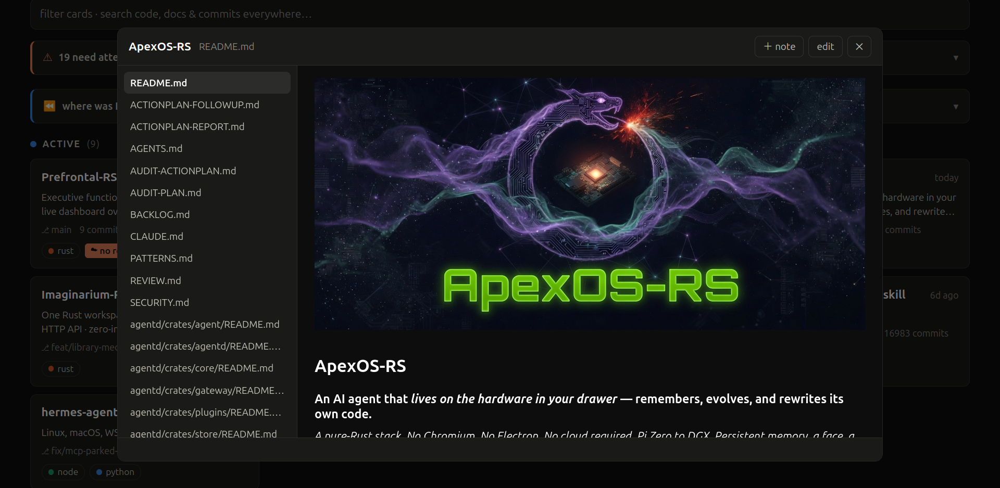
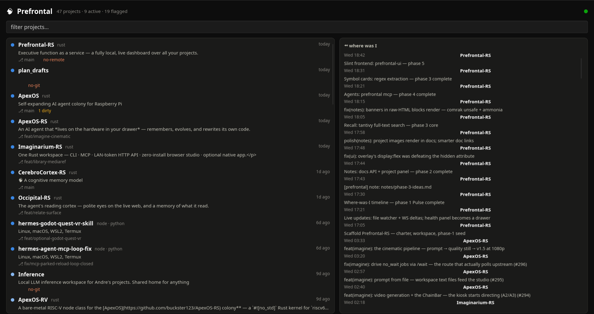

<div align="center">


# Prefrontal-RS

### Executive function as a service — a fully local, live dashboard over all your projects.

*Where was I? What's rotting? Didn't I already write this?*
*One daemon, one browser tab, zero cloud.*

[](https://www.rust-lang.org/)
[]()
[](LICENSE)
[](docs/API.md#mcp--prefrontal-mcp)

</div>

---

You have 40+ project folders. Some alive, some parked, some half-finished,
some you've genuinely forgotten. Prefrontal-RS watches that directory,
understands git, and answers the three questions a scattered brain asks
after being AFK:

- **Where was I?** — a cross-project commit timeline and live activity states,
  so the thread you dropped on Tuesday is one glance away.
- **What's rotting?** — health flags for uncommitted piles, remoteless repos,
  and never-committed folders, *before* a disk hiccup eats real work.
- **Didn't I already write this?** — millisecond full-text + symbol search
  across every project's code, docs, and commit messages — plus optional
  *semantic* recall ("that project where the agent browses the web politely")
  through [CerebroCortex-RS](https://github.com/buckster123/CerebroCortex-RS).

Plus: read, edit, and create markdown notes in-app — the dash commits them
locally (that file only, never a push) so ideas survive the walk to the
kitchen. AI agents get the same brain over MCP.

<div align="center">

<br><sub>The web dashboard reading a project README — banners, badges and all.</sub>
</div>

## How it works

```
┌─────────────────────────────────────────────────────────┐
│ prefrontald                                             │
│  scanner ─ git (gix) ─ watcher (notify, per-dir)        │
│  index (tantivy: code+docs+commits+symbols)             │
│  notes engine (comrak render · pathspec auto-commit)    │
│  [optional] CerebroCortex client (MCP, feature-flag)    │
│  axum: REST + WS (:7320) + static ui-web                │
└──────────────┬──────────────────────┬───────────────────┘
               │ ws/http              │ ws
        ┌──────┴──────┐        ┌──────┴──────┐
        │   ui-web    │        │  ui-slint   │
        │ daily driver│        │ native, for │
        │             │        │ ApexOS boxes│
        └─────────────┘        └─────────────┘
   prefrontal (CLI + MCP stdio) · prefrontal-client (Rust SDK)
```

- **Zero config to first paint** — point it at a root (default `~/Projects`),
  every immediate subdirectory becomes a live card. No per-project dotfiles,
  ever: overrides live in one central config.
- **Actually live** — per-directory inotify watches (build output excluded,
  `.git` watched surgically) debounce into single-project rescans and
  WebSocket deltas. Commit anywhere; the open tab knows within a second.
- **Search that remembers for you** — one tantivy index over file contents,
  commit messages, and ~one tiny document per `fn`/`class`/`struct`
  declaration, so a name query ranks the declaration above the file it lives
  in. ~250k documents indexes in ~20 s, queries answer in ~3 ms.
- **Notes that can't evaporate** — markdown rendered server-side (comrak +
  ammonia sanitization: banners survive, scripts never), edits auto-commit
  with a `[prefrontal]` prefix via pathspec — your staged work is untouchable.
- **Pure Rust, no linking drama** — `gix` (not libgit2), tantivy, regex
  symbol extraction (not tree-sitter's C runtime). One `cargo build`.

<div align="center">

<br><sub>The native Slint frontend — same WebSocket, same palette, runs without a browser.</sub>
</div>

## Quick start

```sh
git clone https://github.com/buckster123/Prefrontal-RS && cd Prefrontal-RS
cargo run --release -p prefrontald        # scans ~/Projects, serves http://127.0.0.1:7320
```

Open the browser tab — that's the daily driver. Optionally:

```sh
cargo run --release -p prefrontal-cli -- status     # the same scan in your terminal
cargo run --release -p ui-slint                     # the native frontend (see LICENSE note)
```

Custom roots, thresholds, per-project overrides: copy
[`config.example.toml`](config.example.toml) to `~/.config/prefrontal/config.toml`.

### The CLI

```sh
prefrontal status      # every project: state, branch, dirty, flags
prefrontal health      # rot check — only the flagged ones
prefrontal timeline    # where was I, grouped by day
prefrontal find lock-free queue     # full-text + symbols, everywhere
prefrontal recall "that vr thing"   # semantic (optional cortex layer)
```

### Agents (MCP)

```sh
claude mcp add prefrontal -- /path/to/prefrontal mcp
```

Seven tools — `list_projects`, `project_status`, `where_was_i`, `search`,
`list_docs`, `read_doc`, `write_doc` — daemon-independent, so agents get
answers even when nothing else is running. Your agent checks whether the
function exists before writing it a second time.

### Extending (Rust SDK)

```rust
let pf = prefrontal_client::Prefrontal::default();
let hits = pf.search("resample", 10).await?;
pf.write_doc("my-project", "notes/idea.md", "# it begins").await?; // auto-commits

let mut events = std::pin::pin!(pf.events().await?);
while let Some(ev) = events.next().await { /* live deltas */ }
```

Full REST/WS/MCP/CLI reference: [`docs/API.md`](docs/API.md).
Design decisions and phase history: [`docs/CHARTER.md`](docs/CHARTER.md).

## The optional cortex

With `features.cerebro = true` and a
[CerebroCortex-RS](https://github.com/buckster123/CerebroCortex-RS) binary
configured, Prefrontal upserts one semantic summary per project into the
cortex (tag-deduped, shared visibility) and answers vague, memory-shaped
queries alongside the lexical index. Without a cortex, everything else works
identically — the flag defaults off.

## Repository layout

| Crate / dir | What |
|---|---|
| `prefrontald` | the daemon — scanner, watcher, index, notes, REST + WS |
| `prefrontal-core` | scanner/config/docs/search/cortex as a library |
| `prefrontal-protocol` | wire types every surface shares |
| `prefrontal-cli` | `prefrontal` binary — human commands + MCP stdio server |
| `prefrontal-client` | tiny Rust SDK over REST/WS |
| `ui-web` | static web frontend, no build step, no CDN |
| `ui-slint` | native frontend (Slint), reading surface |

## License

MIT — see [LICENSE](LICENSE). One caveat, stated plainly: the optional
`ui-slint` frontend links the [Slint](https://slint.dev) toolkit, which is
separately licensed (GPL-3.0 / Royalty-Free Desktop / commercial); building
that one binary is subject to Slint's terms. The daemon, web UI, CLI, MCP
server, and SDK are Slint-free and plain MIT.

---

<div align="center">
<sub>Part of the <a href="https://github.com/buckster123/ApexOS-RS">ApexOS</a> ecosystem ·
banner generated by <a href="https://github.com/buckster123/Imaginarium-RS">Imaginarium-RS</a> ·
built with an AuDHD brain in mind 🧠</sub>
</div>
